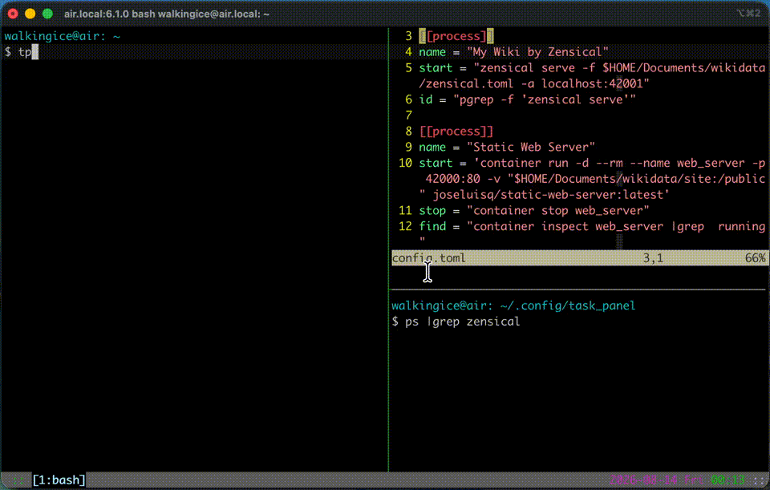

[English](README.md) | [傳統中文](README.zh-TW.md)

# Task Panel

Task Panel（TP）是一個簡單的 terminal UI，用來快速啟動或停止程序。

它的概念接近 systemd，但是非常簡單。

我每天都得反覆啟動或停止許多程式，但這些指令通常帶了不少參數，不太好記。原本我為它們寫了一堆 alias；隨著 alias 愈來愈多，才發現它們的操作邏輯其實很相似。

所以我把啟動與停止指令集中寫進一個 TOML 檔，再由這個程式統一執行。

換句話說，這個程式並不是完整的程序管理工具，而是一個用來管理多組啟動與停止指令的介面。

## Run

1. 參考 [config.example.toml](config.example.toml)，建立設定檔並放到 `~/.config/task_panel/config.toml`。
   - `config.example.toml` 也是設定檔格式的規範。
1. 到 [Releases](../../releases) 下載適合你平台的檔案，解壓縮後執行 binary。

## Demo

使用以下範例設定檔：

```toml
show_start_confirmation=false
show_stop_confirmation=false
[[process]]
name = "My Wiki by Zensical"
start = "zensical serve -f $HOME/Documents/wikidata/zensical.toml -a localhost:42001"
id = "pgrep -f 'zensical serve'"

[[process]]
name = "Static Web Server"
start = 'container run -d --rm --name web_server -p 42000:80 -v "$HOME/Documents/wikidata/site:/public" joseluisq/static-web-server:latest'
stop = "container stop web_server"
find = "container inspect web_server |grep  running"
```

接著依序操作：

1. 啟動 Task Panel。
1. 確認 Zensical 尚未執行。
1. 啟動 Zensical，並用 `ps` 確認它已啟動。
1. 用 container 指令確認 web server 尚未執行。
1. 用 container 指令啟動 web server，並用 `container ls` 確認它已啟動。
1. 停止 web server，並用 `container ls` 確認它已停止。



## Development

- Go: `1.26.0`

```bash
$ make fmt
$ make test
$ make build

$ make # build the binary
```

## Release

- 版本資訊定義在 `task_panel.go` 的 `applicationVersion`。
- 專案使用 GitHub Actions；新增以 `v` 開頭的版本 tag 即可發佈。

```sh
git tag -a v0.1.0 -m "Release 0.1.0"
git push origin v0.1.0
```
